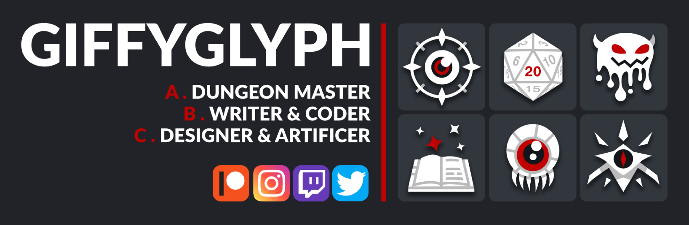

# Hi, I'm Giffyglyph.

**I write rules. I build tools. I play games.**

Here you'll find a collection of my major works and code repositories. If you have a suggestion or there's something you'd like to see me work on in the future, visit the **[issue board](https://github.com/giffyglyph/giffyglyph/issues)** and open a ticket.

## Repositories

1. **[Foundry 5e Monster Maker](https://github.com/giffyglyph/foundry-5e-monster-maker)** _(FoundryVTT Module)_
1. **[Foundry Quick Quest](https://github.com/giffyglyph/foundry-quick-quest)** _(FoundryVTT System)_
1. **[Giffyglyph's Class Compendium](https://github.com/giffyglyph/giffyglyphs-class-compendium)** _(D&D 5e PDF)_
1. **[Giffyglyph's Darker Dungeons](https://github.com/giffyglyph/giffyglyphs-darker-dungeons)** _(D&D 5e PDF)_
1. **[Giffyglyph's Monster Maker](https://github.com/giffyglyph/giffyglyphs-monster-maker)** _(D&D 5e PDF)_
1. **[Giffyglyph's Monster Maker Webapp](https://github.com/giffyglyph/webapp-5e-monster-maker)** _(Webapp)_
1. **[Giffyglyph's Personal Portfolio](https://github.com/giffyglyph/giffyglyphs-personal-portfolio)** _(Website)_
1. **[Giffyglyph's Quick Quest](https://github.com/giffyglyph/giffyglyphs-quick-quest)** _(RPG System)_

### Minor Repositories

1. **[Aberrant Mediawiki Skin](https://github.com/giffyglyph/mediawiki-skin-aberrant)** _(Mediawiki Skin)_
1. **[Giffyglyphs Card Codex](https://github.com/giffyglyph/giffyglyphs-card-codex)** _(D&D 5e PDF)_
1. **[Rapid Reroller](https://github.com/giffyglyph/webapp-5e-rapid-reroller)** _(Webapp)_
1. **[Roll20 5e Darker Dungeons](https://github.com/giffyglyph/roll20-5e-darker-dungeons)** _(Roll20 Character Sheet)_

## Support

If you'd like to see more from me in future, please consider [becoming a patron](https://www.patreon.com/giffyglyph). You can also find more of my work at:

* [giffyglyph.com](https://giffyglyph.com)
* [twitter](https://twitter.com/giffyglyph)
* [twitch.tv/giffyglyph](https://twitch.tv/giffyglyph)
