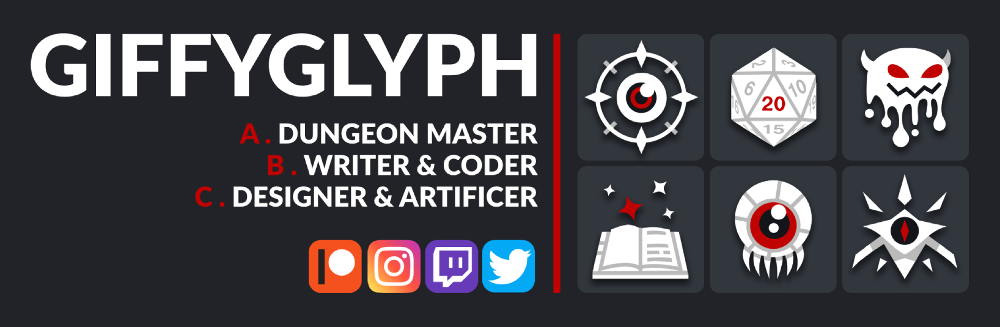

# Giffyglyph's Github

Hi, I'm Giffyglyph.

I write rules. I build tools. I play games.

Here you'll find a collection of my major works and code repositories. If you have a suggestion or there's something you'd like to see me work on in the future, visit the **[issue board](https://github.com/giffyglyph/giffyglyph/issues)** and open a ticket.

## Major Repositories

* [Foundry 5e Monster Maker](https://github.com/giffyglyph/foundry-5e-monster-maker): A D&D 5e monster maker module for the Foundry VTT. Build new monsters with level-appropriate, 
balanced stats in seconds.
* [Foundry Quick Quest](https://github.com/giffyglyph/foundry-quick-quest): Play Giffyglyph's Quick Quest in Foundry VTT with a new, fully-featured system, character sheet, and item cards.
* [Giffyglyph's Class Compendium](https://github.com/giffyglyph/giffyglyphs-class-compendium): Play 1st-to-10th-level D&D 5e with fully-rebalanced classes, including new class resources and unique class powers.
* [Giffyglyph's Darker Dungeons](https://github.com/giffyglyph/giffyglyphs-darker-dungeons): Add new, immersive RPG mechanics to your D&D 5e campaigns with Giffyglyph's Darker Dungeons.
* [Giffyglyph's Monster Maker](https://github.com/giffyglyph/giffyglyphs-monster-maker): Build new D&D 5e monsters and exciting encounters in seconds with Giffyglyph's Monster Maker.
* [Giffyglyph's Monster Maker Webapp](https://github.com/giffyglyph/webapp-5e-monster-maker): Build new D&D 5e monsters and exciting encounters in seconds with Giffyglyph's Monster Maker.
* [Giffyglyph's Personal Portfolio](https://github.com/giffyglyph/giffyglyphs-personal-portfolio): The source code for Giffyglyph's personal portfolio website.
* [Giffyglyph's Quick Quest](https://github.com/giffyglyph/giffyglyphs-quick-quest): Prep and play an RPG quest in just five minutes with Giffyglyph's Quest Quest.

## Minor Repositories

* [Aberrant Mediawiki Skin](https://github.com/giffyglyph/mediawiki-skin-aberrant): A clean, responsive mediawiki skin designed for Giffyglyph's Aberrant Archives.
* [Card Codex](https://github.com/giffyglyph/giffyglyphs-card-codex): A collection of custom-made printable cards for your D&D 5e games.
* [Rapid Reroller](https://github.com/giffyglyph/webapp-5e-rapid-reroller): Generate D&D treasure hoards in seconds with the Rapid Reroller webapp.
* [Roll20 5e Darker Dungeons](https://github.com/giffyglyph/roll20-5e-darker-dungeons): A Roll20 character sheet for the Darker Dungeons 5e supplement.

## Support

If you'd like to see more from me in future, please consider [becoming a patron](https://www.patreon.com/giffyglyph). You can also find more of my work at:

* [giffyglyph.com](https://giffyglyph.com)
* [twitter](https://twitter.com/giffyglyph)
* [twitch.tv/giffyglyph](https://twitch.tv/giffyglyph)
